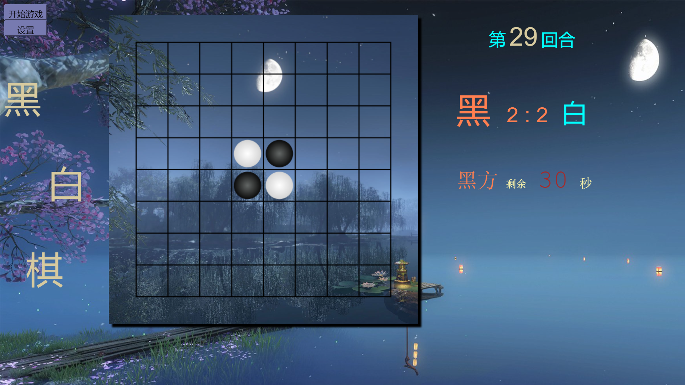

# Reversi
黑白棋项目，这是我刚学前端时候练手的小项目。

完成了本地基本的下棋功能和美化，有单人和双人模式，有下棋提示，还没有实现后台功能和下棋音效，若果需要可自行补充。

## 游戏介绍

黑白棋，也叫翻转棋。对战时，一方通过在横线、竖线、左右斜线方向包夹对方连续的棋子，使之颜色改变为己方棋子，最终棋盘满时，棋子数量多的一方获胜。

## 模式

- 对战模式。可以和朋友两人一起玩。
- 单人模式。在菜单中选择单人模式，即可人机对战，难度有两档。
